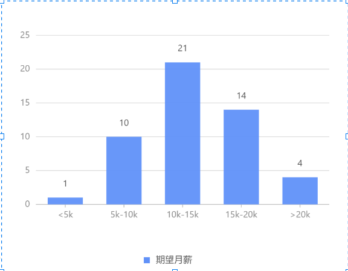

# Survey

**大学生毕业去向调查问卷**

Q1. 您的毕业去向是什么？

Q2.您认为应届大学生发展前景如何？

Q3.您何时确定好的毕业去向？

Q4.对于未来的发展目标，您更看重哪一项？

Q5.您期望未来的月薪是？

Q7.您期望自己的学历达到？

Q8.您对自己的专业满意程度是？

Q9.影响您选择毕业去向的因素有？

Q10.您认为毕业前您需要培养哪些方面的能力？

Q11.您认为考研的目的是？

Q12.您认为读研对以后的就业有多大帮助？

Q13.未来希望去哪类城市？

Q14.您认为项目及实习经历是否重要？

Q15.您周围有创业意向的人有多少？

