# 问卷分析

## 调查分析
本项目调研共收集了50份数据进行分析
### 1.毕业生意愿情况概览：

由上图可知，在毕业生去向意愿中以考研和求职就业居多，两者人数大致相仿，选择创业及其他的人数较少。

**毕业意愿的影响因素及毕业前需要培养的能力：** 

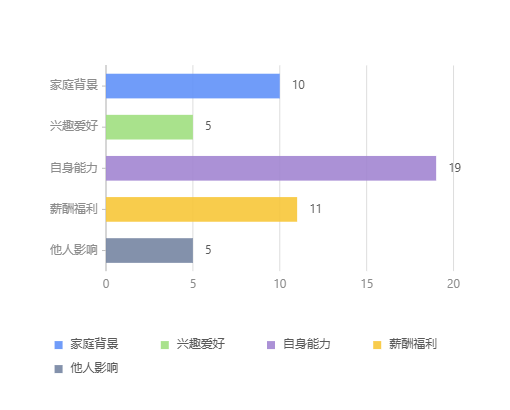
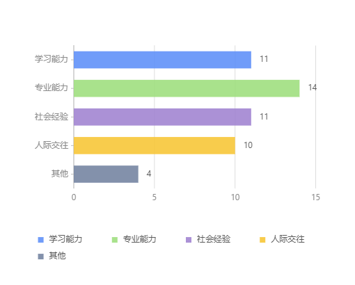

大多数毕业生选择毕业意愿是出于综合考虑，比较重要的因素是根据自身能力合理选择出路。此外，在各种需要培养的自身能力中，各选项人数大致相仿，专业能力稍稍突出，可见参与调查的大学生中，综合发展观念相对较强。

**确认意愿时间：**

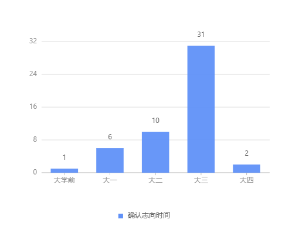

绝大多数学生是在大三期间决定自身的毕业意愿，也有小部分学生前瞻意识与规划能力较强，早早决定好了毕业意愿。

**毕业生前景期望：**

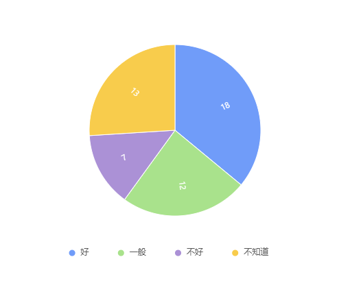

在参与调查者中，只有18人对毕业生前景看好，也有较多的同学选择了不知道，可见在经济下行的现在，大多数学生对毕业生前景持相对一般的态度。

**对学历的期望:**

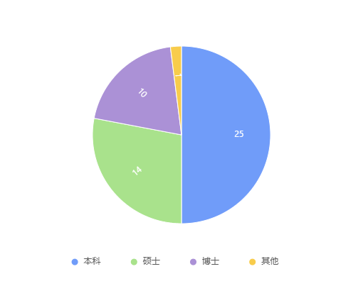

其中，有一半同学的学历预期是本科，硕士及博士共计24人，与选择求职就业和考研的人数相对应。

**对所学专业是否满意：**

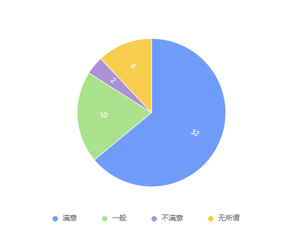

64％的同学对所学专业表示满意，12％表示无所谓，不满人数占比只有4％。总的来看，同学们对所学专业的认可度相对较高

**以后定居地：**

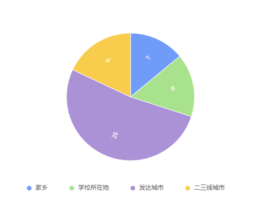

半数以上均位于发达城市，也有同学选择家乡与母校所在地。发达城市经济繁荣机会多，收入水平也相对较高，是大部分学生的首选。而家乡与母校所在地有一定的人文地理优势

## 2.求职就业情况：

**影响选择工作的因素**

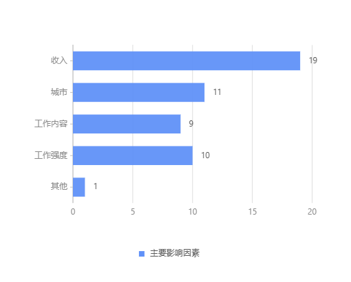

影响求职择业的首要因素是收入，其他诸如工作内容与强度等也是比较重要的考虑因素。大多数同学比较务实。

**期望月薪：**

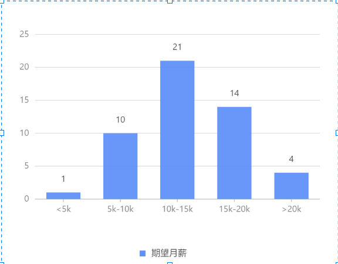

大多数同学的期望月薪集中在10k-20k的区间，对于本校的985毕业生来说，薪资水平较于市面平均水平来讲还是要稍高一些。

**项目实习经历对求职是否重要：**

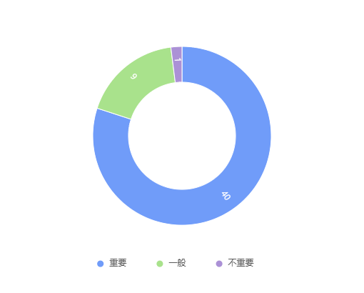

绝大部分学生认可项目实习经历对于求职的重要性

## 3.考研情况：

**为何选择考研：**

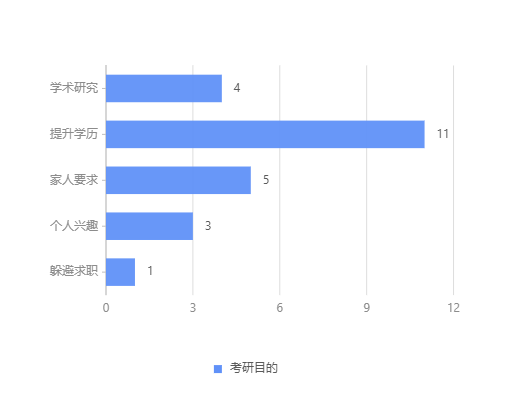

大多数学生选择考研仅仅是为了提升学历，有志于学术研究或者出于个人兴趣继续深造的占比较小。

**考研对就业作用如何：**

70％的同学认可考研对就业的作用，可以推测大部分人选择考研提升学历，依旧是为了更好地就业。

## 4.其他：
**周围是否有人想要创业：**

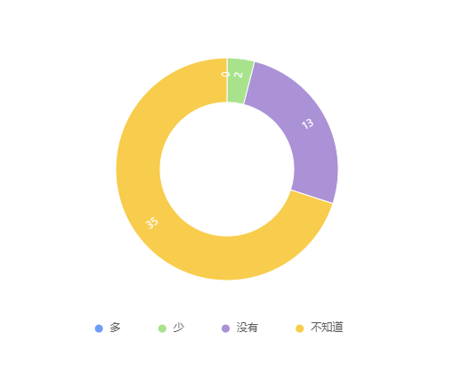

70％的同学选择不知道，另有26％选择没有，可见创业一事对当下的大学毕业生来讲是一件鲜有为之的选项。

## 总结
在收集的50份数据中，考研人数与求职人数大致相仿。就业同学也在提前准备求职活动，选择工作时会考虑多种因素，且想法较为务实。在后疫情时代的大环境下，这透露出一种必然性。
我们还注意到，在选择考研的同学中，注重学术研究与期望自己学历到达博士的人均不足一半，这从侧面证明多数同学选择考研其实是为了更好地就业。